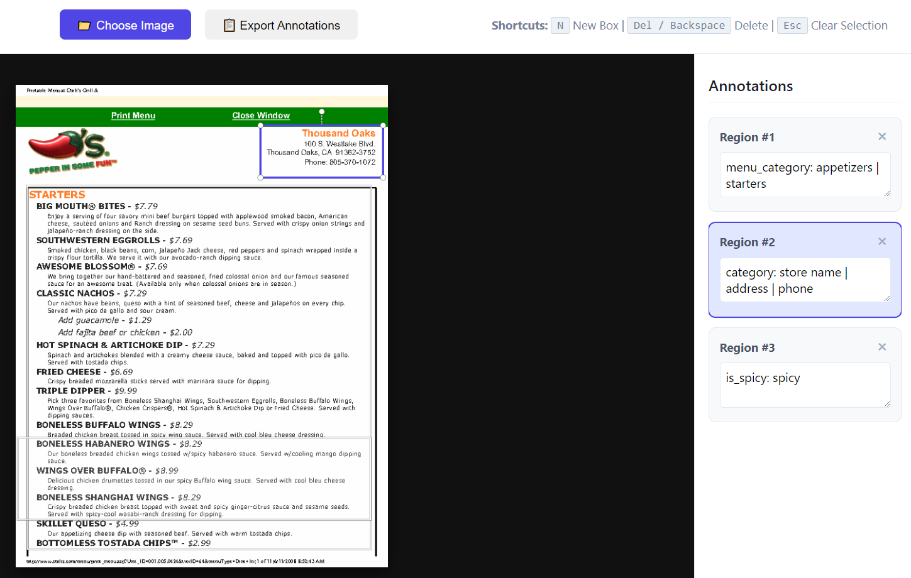

# RAG / ETL Demos: 3 Pipelines Showing Different Extraction and Usage Concepts

### A bare-bones demonstration of entire RAG data pipelines, extracting raw data from a multi-page PDF, processing and storing it, and then using an AI chat model to make natural language queries against it.

Scraped right off the [IBM website](https://www.ibm.com/think/topics/rag-vector-database), this defines RAG nicely:

>Retrieval-augmented generation (RAG) is an architecture that connects large language models (LLMs) to external knowledge sources, enabling it to retrieve relevant information and incorporate that context into its responses at query time.

This project is less about how to make all the little pieces and more about how to string them together into a working proof-of-concept system.

-----------------------------

# Pipeline #1: Extracting and Using Metadata to Add Specific Context and Semantic Meaning for LLM Queries

## Ingestion of PDF as text then processing it with 2 separate metadata extraction methods

*Main files: rag_scrape_pdf_txt.py, annotate/annotate.html*

### PDF -> DATA/METADATA -> DB -> AI -> RESULTS

### Method #1: Annotate PDF pages with bounding box areas on each page to associate with metadata
- The annotate.html web page app is a tool to generate those boxes for each page in the PDF
- Run the PDF through the Python utility function *'utils_pdf.convert_pdf_to_imgs()'* to create the page images used for annotation
- Screenshot and example data format of the annotation web page app:



- Regions/boxes on the page define metadata for each page in the PDF:
```python
{
    "pg1": [
        {
            "id": "cc1583f4-f7cb-476d-a4fb-7ed9ca81a3ad",
            "text": "menu_category: appetizers | starters",
            "x0": 18.99916577737274,
            "y0": 165.87696013046988,
            "x1": 583.6205452262581,
            "y1": 762.9501119474086
        },
        {
            "id": "60a66ddd-fded-4ea5-baec-12ba4a40541a",
            "text": "category: store name | address | phone",
            "x0": 401.9507171121289,
            "y0": 66.70911007939999,
            "x1": 603.2325962611607,
            "y1": 152.44798508675572
        },
        {
            "id": "c2f22fb2-453f-44f5-ae77-7438f97e7000",
            "text": "is_spicy: spicy",
            "x0": 3.515980600204898,
            "y0": 580.1093690453506,
            "x1": 582.5882991868622,
            "y1": 713.7854988589179
        }
    ]
}
```
- The PdfPlumber library provides layout/positional data about the text lines, which can be used to determine if a line is within a bounding box and if so, will have that box's metadata applied to it
- The JSON data from the annotate.html app is used for this part of the processing

### Method #2: Parse each line on the a page to extract data points for metadata usage
- Parsing / extract metadata of semantic value to aid in retrieval
- Each line is considered a 'chunk'
- Inspect each line of text for key word/phrases that will then be associated with metadata, e.g., if the word 'cheese' is found with a menu item, then we can tag that menu item with something with semantic meaning, such as 'contains dairy'
```python
# Python code snippet defining RegEx patterns for data parsing/extraction, each of them being applied to every line of data...

r"(?i)\$(?P<dollars>\d+)\.(?P<cents>\d{2})"
, r"(?i)\$(?P<price>\d+\.\d{2})"
, r"(?i)(?P<menu_item>.*) - .*\$\d+\.\d{2}.*"
, r"(?i).*(?P<contains_dairy>(cream|sour cream|cheese|milk|queso|quesa))"

```
### Both metadata extraction processes yield a combined data object for each line of text in the data, for example:
```python
# Python JSON code snippet for a data object for a line in the data...
    {
        "id": "pg_1_ln_39",
        "row": "BONELESS SHANGHAI WINGS - $8.29",
        "metadata": {
            "menu_category": [
                "appetizers",
                "starters"
            ],
            "is_spicy": [
                "spicy"
            ],
            "dollars": 8.0,
            "cents": 29.0,
            "price": 8.29,
            "menu item": "boneless shanghai wings",
            "page": 1,
            "line": 39,
            "source": "./data/in/chilismenu.pdf"
        }
    },

```

### Put extracted data/metadata into vector DB

*Main file: utils_chroma.py*

- Vectorize that data into persistent ChromaDB database along with the metadata
- Embedding this model into a chat session will allow for more usable and accurate search results

### Time to use it

*Main file: rag_chat_embed.py*

- Just by itself, the vectorized PDF data can be searched by the chat model and gives results more reliant on the quality of the LLM model you use.  The smaller, resource-constrained models can really suffer when they can't hold enough context to generate reliable results.  For example, without filtering, the entire PDF data will be returned for the chat model's context and it will be truncated, resulting in unreliable answers:
```
Question: List all the menu items that are spicy along with their price.

Thinking...
[AI Response]:
*   **Spicy Garlic & Lime Grilled Shrimp:** $9.99
*   **JALAPEÑO SMOKEHOUSE BACON BIG MOUTH BURGER:** $8.99
*   **CHILI’S CLASSIC SIRLOIN:** $12.99
```

- With filtering by metadata, the context can be smaller (hopefully not truncated) and more focused to help answer the query because it only looks at those data items with 'spicy' metadata:
```python
# python snippet showing how to filter by metadata in a vector DB
{"is_spicy":{"$contains": "spicy"}}
```
- This results in more accurate answers because all data items with 'spicy' metadata now fit in the context the chat model can analyze:
```
Question: List all the menu items that are spicy along with their price.

Thinking...

[AI Response]:
Based on the provided context, the menu items that are spicy along with their prices are:

*   **BONELESS HABANERO WINGS** - $8.29
*   **WINGS OVER BUFFALO®** - $8.99
*   **BONELESS SHANGHAI WINGS** - $8.29
```

## Libraries
- Python 3.14, pdfplumber, ollama, chromadb, json, regular expressions
- Ollama for running models, choose your own

## Misc
- try with postgreSQL/pgvector?
- improve annotate app to save / reload state


-----------------------------

# Pipeline #2: Extracting Data Tables for Natural Language LLM Chat to Query/Retrieve Information

## Ingestion of PDF data table and then converting to JSON data table that can be queried with SQL
This has the notable use of AI *only* to take natural language and make a valid SQL query.  Such a tight focus on code generation within narrow paremeters makes it possible to use smaller, but tailored for coding AI models.

*Main file: rag_scrape_pdf_tbl.py*

### PDF TABLE -> DATA TABLE -> JSON -> AI -> SQL -> RESULTS

### Put extracted data into JSON file
- PdfPlumber has built-in table extraction utilities, including layout/position information that can be used to dynamically figure out columns' locations on the page and use that information to correctly extract column data from each line of data found in a table; this makes it easy to construct a data object that can then be queried via SQL

### Time to use it

*Main files: rag_chat_json.py, utils_duckdb.py*

- Before an AI chat model can try to query a datastore, it must know about the structure of the data, i.e., it's 'schema' among other things
- DuckDB will first dynamically generate that information and provide it as context for the AI chat model
- Natural text to sql will then query that JSON data to answer the question:
    ```
    Show the menu items name, calories and protein with more than 70 grams of protein, sorted by protein in descending order.
    ```
    - The AI model is only used to generate a SQL query that can be run against the data table.
    - The generated SQL is automatically used to query the data:
    ```sql
    SELECT "menu_items"."menu_item", TRY_CAST("menu_items"."Prot (g)" AS FLOAT) AS Protein, "menu_items"."Cals" FROM menu_items WHERE TRY_CAST("menu_items"."Prot (g)" AS FLOAT) > 70 ORDER BY Protein DESC
    ```

    - Query Results:
    ```python
    ('Classic Nachos - Beef - Large', 109.0, '1590')
    ('Classic Nachos - Chicken - Large', 99.0, '1420')
    ('Classic Ribeye', 86.0, '1280')
    ('Memphis Dry Rub Ribs - Full Rack', 84.0, '1690')
    ('Original Ribs - Full Rack', 82.0, '1580')
    ('Bacon Ranch Beef Quesadilla', 80.0, '1800')
    ('Chipotle Chicken', 79.0, '1320')
    ('California Grilled Chicken', 77.0, '1450')
    ('Texas Cheese Fries - Full Order', 75.0, '1720')
    ('Bacon Ranch Chicken Quesadilla', 74.0, '1690')
    ('Classic Nachos - Beef - Regular', 73.0, '1090')
    ('Bacon Avocado Chicken Sandwich', 73.0, '1580')
    ('10 oz Classic Sirloin', 73.0, '1000')
    ('Cajun Pasta w/ Grilled Chicken', 71.0, '1270')
    ```


## Libraries
- Python 3.14, pdfplumber, ollama, duckdb, json
- Ollama for running models, choose your own


